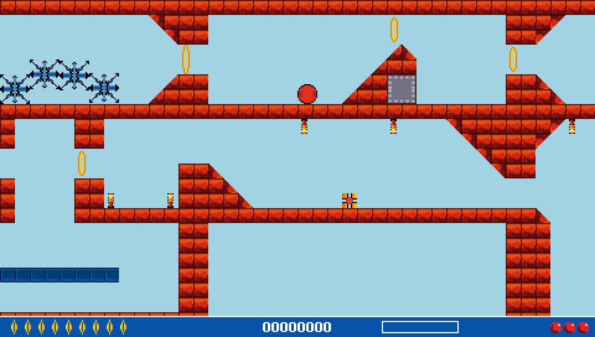

# Bounce Zero (English)

A port of the original **Bounce (2002, Java/Sun for Nokia 7210)** to the **PlayStation Portable (PSP)**.  
The game logic is fully reimplemented in **C** while using only the original game assets from the Nokia version.  
This project is for research/archival purposes; original content is not modified.

## Screenshots




## Features
- Reads and uses the original game data from the Bounce 2002 JAR (authentic resources only).
- Full reimplementation of the game loop and core mechanics in C (no Java bytecode interpreter).
- Works on real PSP hardware and in the PPSSPP emulator.
- Minimal system requirements; no external runtime dependencies.

## Build
Requires an installed [PSP SDK (pspdev)](https://github.com/pspdev/pspdev).

```bash
sudo apt-get update
sudo apt-get install build-essential cmake pkgconf libreadline8 libusb-0.1 libgpgme11 libarchive-tools fakeroot wget
wget https://github.com/pspdev/pspdev/releases/latest/download/pspdev-ubuntu-latest-x86_64.tar.gz
tar -xvf pspdev-ubuntu-latest-x86_64.tar.gz -C $HOME
export PSPDEV="$HOME/pspdev"
export PATH="$PATH:$PSPDEV/bin"
make
```

The built file `EBOOT.PBP` will appear in the `release/` directory.

## Run
Copy the contents of the `release/` folder to the PSP memory stick:

```
/PSP/GAME/BounceZero/
```

Or open `EBOOT.PBP` with the PPSSPP emulator.

## Compatibility
- PlayStation Portable (tested on 6.xx CFW)
- PPSSPP emulator (recent versions)

## License
Source code is distributed under the **MIT** license.  
All original materials (*Bounce, 2002*) are owned by **Nokia** and/or **Sun Microsystems** and are used solely for research purposes.

## About the experiment
All source code was written with the **Claude AI** model as part of a **vibe-coding** experiment—building the game logic from behavior descriptions.  
This project is non‑commercial and intended for research only.

---

[Русская версия](README.md)
